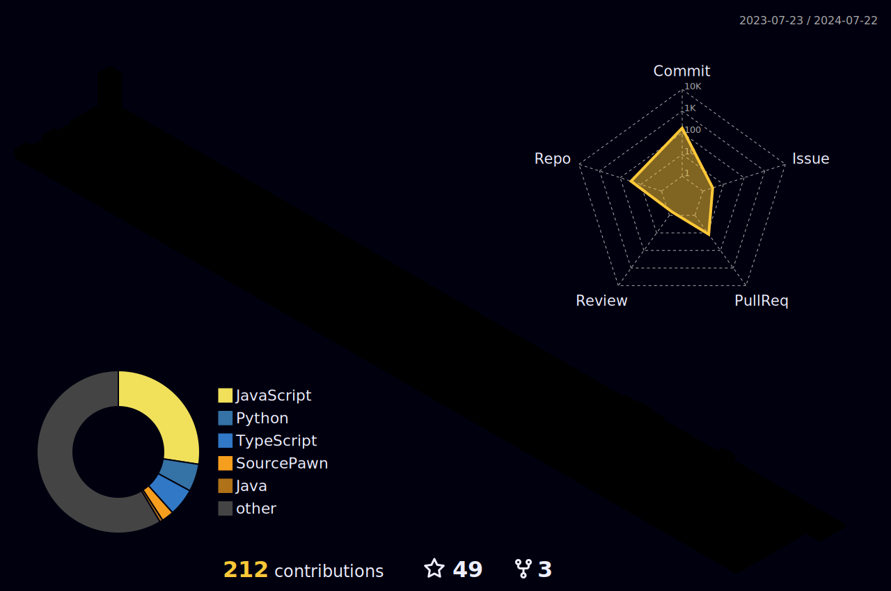

<div align="center">
  
  <h1>Oi , Eu sou o Zeneilton!</h1>
  <h2>E você está no meu perfil 😃, seja muito bem-vindo(a)</h2>

  <h3>Um pouco sobre mim:</h3>
  
  
  
  <a href=""></a>
  <a href=""></a>

```
👨‍🎓 Sou um estudante de Análise e Desenvolvimento de Sistemas na Universidade Estácio de Sá, apaixonado por tecnologia
e programação desde 2012, quando comecei meu curso de TIC noInstituto Federal do Sertão Pernambucano (IFPE).
Lá, aprendi HTML, CSS e Java.

🔧 Após um intervalo de cerca de 10 anos trabalhando com suporte técnico em TI, retomei meus estudos e aprimorei minhas
habilidades em Frontend, dominando tecnologias como React.Js, Next.Js, Tailwind-CSS, entre outras.

📚 Concluí com sucesso o curso de backend oferecido pela iFood e já possuo o certificado em mãos.
Além disso, completei um bootcamp pela empresa Nearx Innovation School - Bootcamp Optimism para Blockchain, Cryptos Ativos.

🚀 Atualmente, estou focado no desenvolvimento backend, utilizando tecnologias como JavaScript, Node.Js, Express.Js,
TypeScript, PostgreSQL, Java Spring e Spring Boot. Continuo buscando me aprimorar para me tornar um programador de alto
nível e estou pronto para enfrentar desafios no mundo da programação.
```
##

  ## [Professor da Turma no Servidor dos Programadores - (Junte-se a Nós)](https://discord.gg/servidordosprogramadores) 📚👨🏽‍🏫

  [](https://roadmap.sh)

  
   <br />

  

  <a href="https://wakatime.com/@5b16e0ec-6419-487c-9792-82c9468dd942"></a>
  
  ## Algumas Linguagens que tenho estudado até aqui! 😃
  
  <h2> 💻 Como Desenvolvedor Frontend: </h2>
  

  <h2> 🚪 Como Desenvolvedor Backend: </h2>
  

  <h2> 🛠️ Ferramentas Favoritas: </h2>
  

#
<p align="center">  </p>

# Entre em Contato Comigo!

  <a href="https://www.linkedin.com/in/zeneilton-granja/"></a>
  <a href="https://wa.me/5587991460246?text=Olá!%20Deixe%20uma%20mensagem%20para%20o%20DevZen!"></a>
  <a href="mailto:zeneiltongranja@gmail.com"></a>

</div>  
